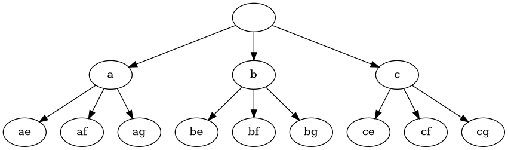

# NumericKeypadProblem

Given a mobile numeric keypad with the digits 2-9 representing different chunks of the alphabet, return an array of all possible letter combinations from a given digit string.

## Solution

do a Depth first search, adding a new string everytime the bottome of the graph is reached.

this would be the graph of the string "23"

